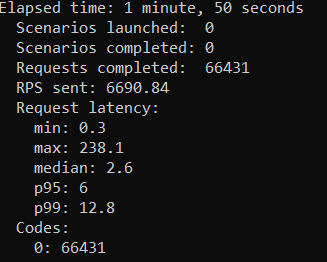
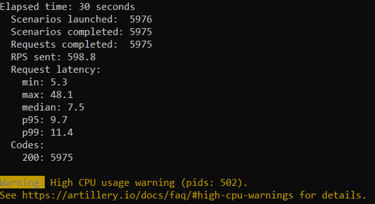

# Summary of Efforts on System Design Challenge

### By Tom Gower

*This README is a summary of the work I did on a project to take an existing codebase, scale up the small amount of data from that stored on the back end in that codebase (with fake data), and to test storing that expanded data in both a SQL and a no-SQL database. A fuller description of my specific efforts, in the form of a daily engineering journal with specific screenshots, is available in [a Google doc](https://docs.google.com/document/d/1M0dqk0pfQJZZX1Kvee5fDJBgyOadAwtzIQ7gM7BkOI4/edit?usp=sharing).*

## Project Goal

The goal for this System Design Challenge (SDC) was to take an existing codebase, with a small amount of data stored on the back end, and to significantly increase the amount of data stored on the back end, store that data in an unfamiliar (to me) and different (from the original) SQL and noSQL database, and to attempt to optimize query response speed in both databases.

**The Existing Codebase**: The search bar for an Amazon-style product page.

**The Increase in Stored Data**: From 100 to 10 million records.

**The Original Database**: mySQL.

**The New Databases**: PostgreSQL (SQL) and Mongo DB (noSQL).

**Why Those New Databases?**: Freely available, and very popular.

## Project Process

1. Install and seed both databases, testing different seeding methods.
2. Test query response speeds in both databases.
3. Attempt to optimize query response speeds.

### First: Install and seed both databases, including different methods of seeding

In my previous exposure to mySQL, I had become familiar with the package Knex. Knex lets you do operations on (most) SQL databases without having to learn the syntax specific to that SQL database. Given my previous experience with seeding mySQL, seeding a Postgres database was not significantly more difficult.

The biggest complication came with the difficulty of adding 10 million items. This had a couple components:

1. An array of 10 million items is a lot. To successfully seed the database from my personal computer without running into memory problems, I ended up doing 10,000 loops of 1,000 items each.
2. By splitting up the 10 million items into 10,000 arrays, Faker could not ensure uniqueness. I could not have 10 million unique records, like a real Amazon might.

Once I successfully seeded the PostgreSQL database, I found that the most efficient, fastest way of seeding the MongoDB and of seeding the PostgreSQL database was to use a CSV exported from an existing database. Using this method, my seeding time for Postgres dropped from 2m30s to 0m35s, and my seeding time for MongoDB was 1m22s.

### Second: Test query response speeds in both databases

The theme of these efforts was that databases are complicated, and several factors you might not consider might have significant efforts on your efforts to stress test a database.

The inability to create 10 million unique items had two complicating effects on my efforts to test query response speeds.

1. If I did a raw query, I would get a lot of duplicate results.
2. If I limited the query to a certain number of responses, I could not test the depth of the database. In testing, I rarely got to 200,000 items in the database, far short of the 10 million I scaled up to.
3. The difference between the two was significant. A common product name like `Intell%` might get 588,549 results and take 6s959ms, and limiting `%Intell%` to 10 items would return 10 items and take 48ms.

Another Postgres-related challenge was case-sensitive queries. `Intell%` and `intell%` do not automatically produce the same results. I spent a fair amount of time trying to investigate this, and came to the conclusion that this problem is, in its rawest form, unavoidable. The most obvious response to this is to index the actual product name and an all-lower case version of the product name, and to search a lower cased-query against the lower case name, but I decided to try other things instead.

### Third: Attempt to optimize query response speeds

I had made one significant step in my initial progress to address query response speeds, changing the schema of the database. The existing codebase had two tables, one for categories and a second for specific products, which contained a reference to the categories table. Returning a single product and its category required querying both databases. I refactored this to a single table with both product and category name.

I ended up using the testing tool [Artillery](https://artillery.io/) to test the speed of responses to database queries.

Artillery was particularly attractive to me because of the NPM package [Artillery.io SQL Plugin](https://www.npmjs.com/package/artillery-engine-sql). This let me directly query the SQL database to test the response speed of that, in addition to testing the response speed of the website.

The results of these experiments were very instructive. While I could not test the MongoDB in the same way, I found that I was able to reach or exceed 6000 RPS directly testing the Postgres database.

Testing the website, whether with MongoDB or Postgres, produced results a whole order of magnitude less, around 600 RPS.

From this result, I reached the conclusion that, with generally non-taxing queries of the sort I was doing, the most important thing to do was to scale the server (which I was testing locally), rather than scaling the database.
